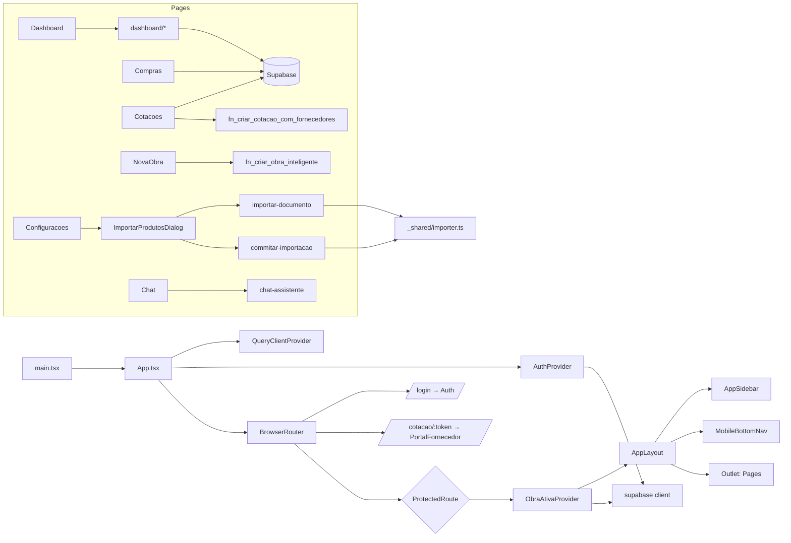

# 18 - Dependency Graph

## Dependências principais entre módulos
- **`useAuth`** → consumido por: `App.tsx` (guards), toda página que precisa de `user.id`.
- **`useObraAtiva`** → consumido por: todos os widgets do Dashboard, `AppSidebar`, `RequireObra`, `Etapas`, `Compras`, `Financeiro`, `Cotacoes`, `Galeria`, `Documentos`, `Materiais`.
- **`supabase` client** → consumido por: hooks acima + todas as páginas + Edge Functions.
- **`_shared/importer.ts`** → consumido por: `importar-documento` e `commitar-importacao`.
- **`regras-decisao.ts`** → consumido por: `apoio-decisao` edge function.

## Regra: quem depende de quem
- **NADA** deve depender de `src/pages/*` (páginas são folhas).
- **NADA** deve depender de Edge Functions no frontend, exceto via `supabase.functions.invoke`.
- `src/components/ui/*` não pode depender de `src/hooks` (evita ciclos).
