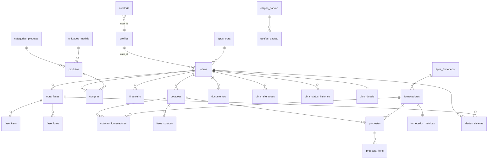

# 21 - Data Model (ERD)

## Relacionamentos-chave
- `obras.user_id` = `auth.uid()` (não FK para `auth.users`; conceitual via `profiles.id`).
- `fase_itens` dispara triggers que atualizam `obra_fases` e criam `alertas_sistema`.
- `propostas` dispara triggers que atualizam `fornecedor_metricas` e `fornecedores.status`.
- `cotacoes.token_publico` é o único identificador usado pelo portal público.
- `compras.produto_id` → `produtos.id` **ON DELETE RESTRICT** (não permite excluir produto usado).
