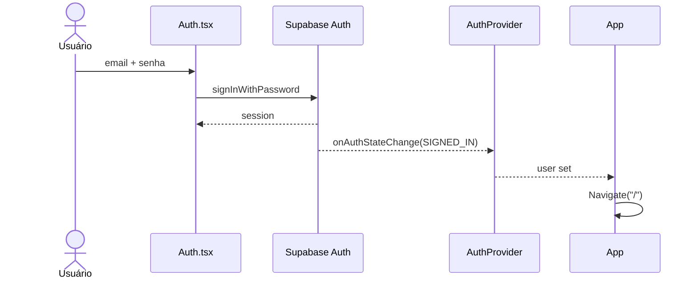
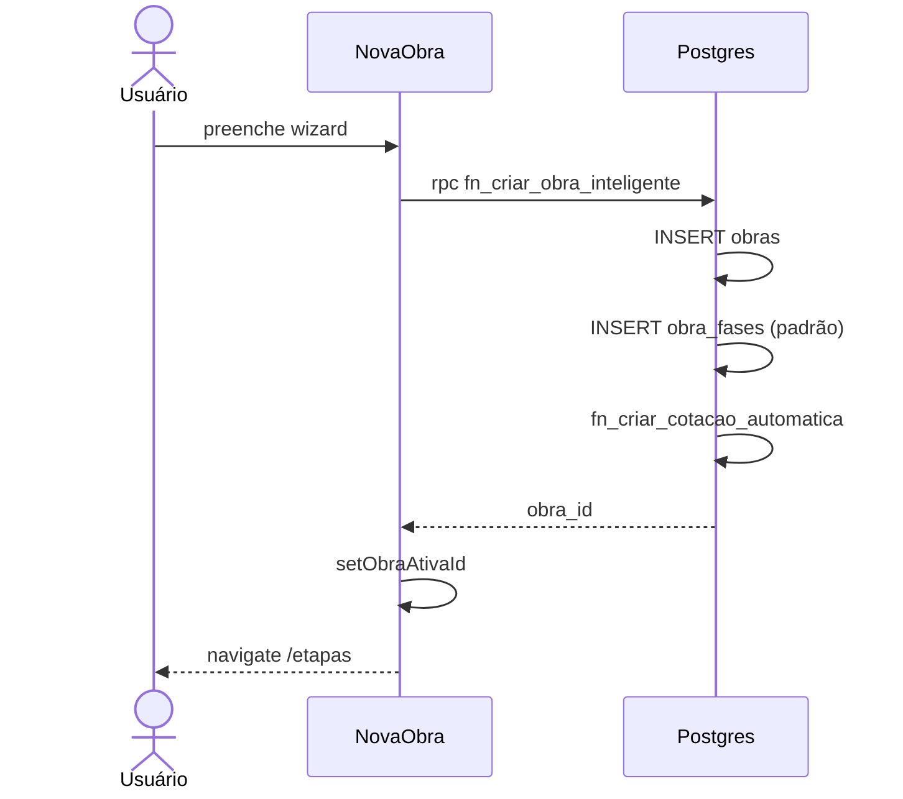
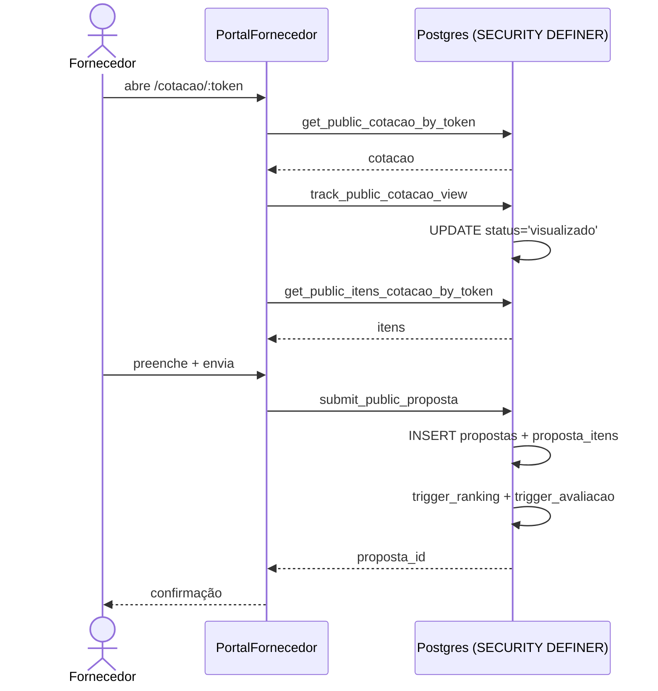
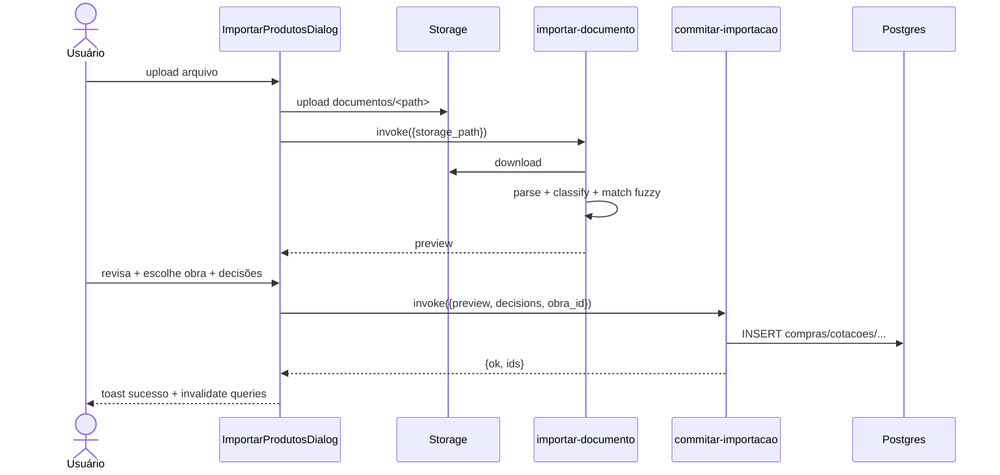
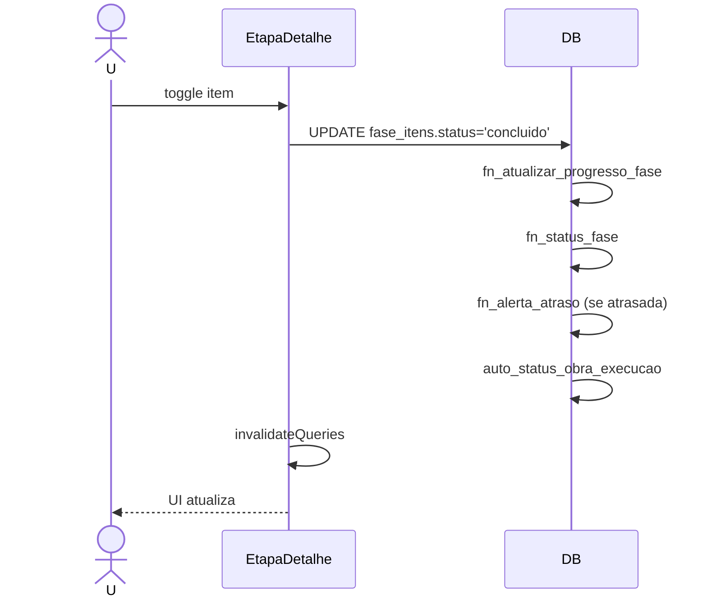

# 22 - Sequence Diagrams

## Login

```mermaid
sequenceDiagram
  actor U as Usuário
  participant A as Auth.tsx
  participant SB as Supabase Auth
  participant AP as AuthProvider
  U->>A: email + senha
  A->>SB: signInWithPassword
  SB-->>A: session
  SB-->>AP: onAuthStateChange(SIGNED_IN)
  AP-->>App: user set
  App->>App: Navigate("/")
```

## Criar obra inteligente

```mermaid
sequenceDiagram
  actor U as Usuário
  participant N as NovaObra
  participant DB as Postgres
  U->>N: preenche wizard
  N->>DB: rpc fn_criar_obra_inteligente
  DB->>DB: INSERT obras
  DB->>DB: INSERT obra_fases (padrão)
  DB->>DB: fn_criar_cotacao_automatica
  DB-->>N: obra_id
  N->>N: setObraAtivaId
  N-->>U: navigate /etapas
```

## Portal do fornecedor (público)

```mermaid
sequenceDiagram
  actor F as Fornecedor
  participant PF as PortalFornecedor
  participant DB as Postgres (SECURITY DEFINER)
  F->>PF: abre /cotacao/:token
  PF->>DB: get_public_cotacao_by_token
  DB-->>PF: cotacao
  PF->>DB: track_public_cotacao_view
  DB->>DB: UPDATE status='visualizado'
  PF->>DB: get_public_itens_cotacao_by_token
  DB-->>PF: itens
  F->>PF: preenche + envia
  PF->>DB: submit_public_proposta
  DB->>DB: INSERT propostas + proposta_itens
  DB->>DB: trigger_ranking + trigger_avaliacao
  DB-->>PF: proposta_id
  PF-->>F: confirmação
```

## Importação de documento

```mermaid
sequenceDiagram
  actor U as Usuário
  participant D as ImportarProdutosDialog
  participant S as Storage
  participant EF1 as importar-documento
  participant EF2 as commitar-importacao
  participant DB as Postgres
  U->>D: upload arquivo
  D->>S: upload documentos/<path>
  D->>EF1: invoke({storage_path})
  EF1->>S: download
  EF1->>EF1: parse + classify + match fuzzy
  EF1-->>D: preview
  U->>D: revisa + escolhe obra + decisões
  D->>EF2: invoke({preview, decisions, obra_id})
  EF2->>DB: INSERT compras/cotacoes/...
  EF2-->>D: {ok, ids}
  D-->>U: toast sucesso + invalidate queries
```

## Concluir item de fase

```mermaid
sequenceDiagram
  actor U
  participant EI as EtapaDetalhe
  participant DB
  U->>EI: toggle item
  EI->>DB: UPDATE fase_itens.status='concluido'
  DB->>DB: fn_atualizar_progresso_fase
  DB->>DB: fn_status_fase
  DB->>DB: fn_alerta_atraso (se atrasada)
  DB->>DB: auto_status_obra_execucao
  EI->>EI: invalidateQueries
  EI-->>U: UI atualiza
```
