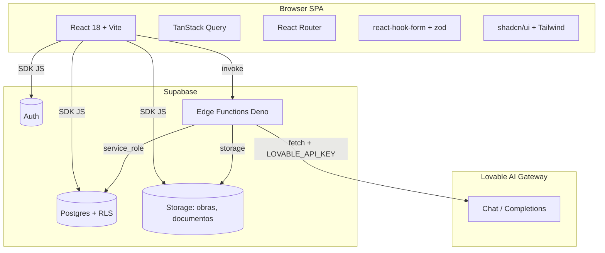
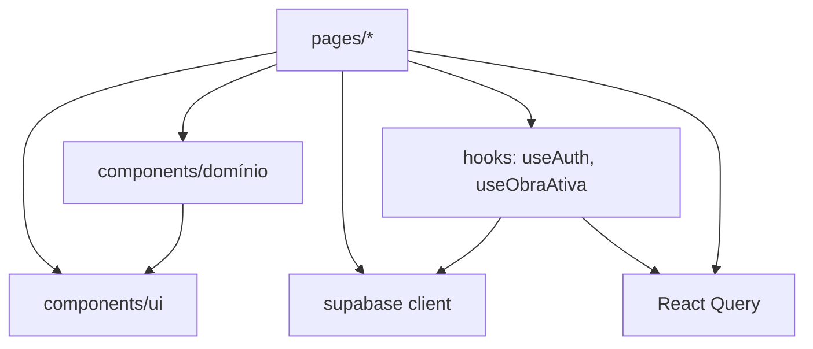
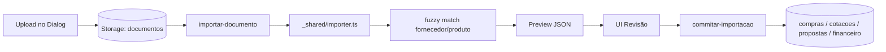

# 23 - Architecture Diagrams

## Alto nível


## Camadas do frontend


## Fluxo de importação (interno)


## Multi-tenancy (atual)
```mermaid
flowchart LR
  A[auth.uid()] --> RLS[RLS policies user_id = auth.uid()]
  RLS --> Rows[Linhas isoladas por usuário]
```
